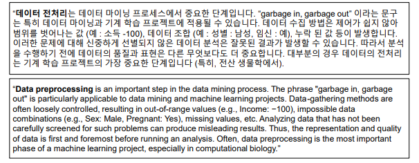

# 01 Data Pre-processing  Definitions

## 1. 데이터 전처리 정의 &#x20;

### 1.1 데이터 분석 가치 사슬(Data Analytics Value Chain)      &#x20;

데이터 기반 의사결정을 위한 가치 사슬은 아래와 같으며, 데이터 분석으로 인사이트 도출과 실행으로 가치를 만드는 것이 핵심이다.  &#x20;

.png>)

### 1.2 데이터 전처리는 데이터 분석에서 가장 중요한 단계  &#x20;

출처 : [https://en.wikipedia.org/wiki/Data\_pre-processing](https://en.wikipedia.org/wiki/Data\_pre-processing)

### 1.3 Raw Data를 정리된 데이터로 만드는 과정 &#x20;

.png>)

출처 : [https://en.wikipedia.org/wiki/Data\_preparation](https://en.wikipedia.org/wiki/Data\_preparation)

### 1.4 요약  &#x20;

* 원시데이터(RawData)를 데이터 분석이 가능한 형태로 만드는 과정이다.   &#x20;
* 그래서 데이터 마이닝과 머신러닝 프로젝트에서 가장 중요한 단계이다.   &#x20;
* 분석석 데이터 전처리의 데이터 품질은 가장 다루기 어려운 문제지만 해결책은 현재 없어 보인다.    &#x20;
* 하지만 데이터 품질이 보장되지 않으면 데이터 분석 결과는 사용하기 어렵다   &#x20;

.png>)

